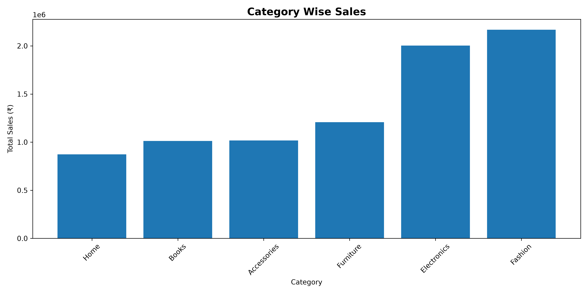
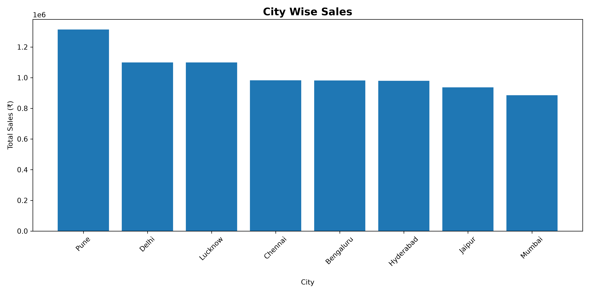
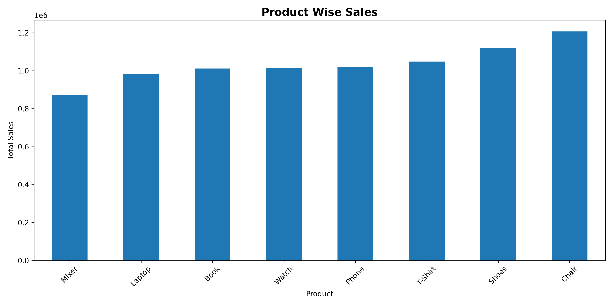
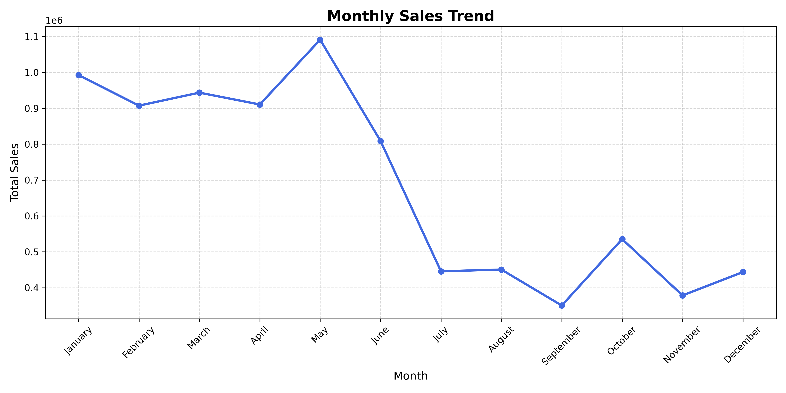
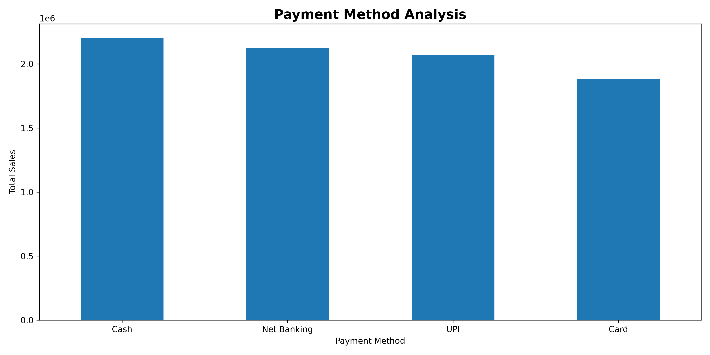
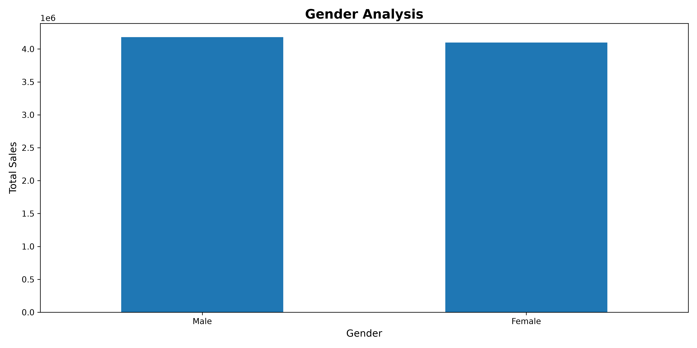
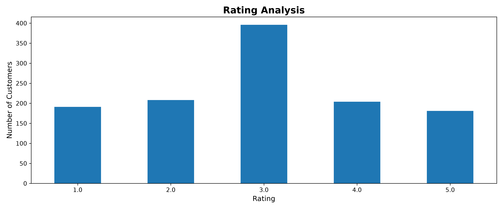
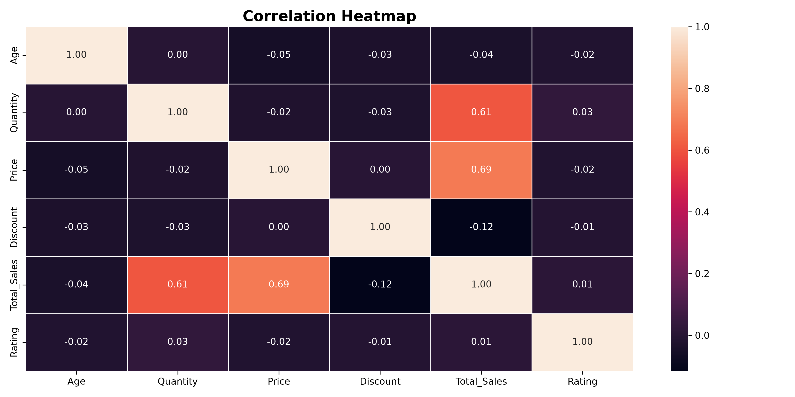

# 🛒 Retail Sales Exploratory Data Analysis (EDA)

## 📌 Project Overview

This project performs **Exploratory Data Analysis (EDA)** on a retail sales dataset using Python. The objective is to analyze sales performance, customer behavior, product performance, payment preferences, and identify valuable business insights through data visualization and statistical analysis.

---

## 🎯 Objectives

- Analyze retail sales performance
- Identify top-performing products and categories
- Study monthly sales trends
- Understand customer purchasing behavior
- Analyze payment methods
- Evaluate customer ratings
- Discover relationships between numerical variables
- Generate business insights for decision-making

---

## 🛠️ Tools & Technologies

- Python
- Pandas
- NumPy
- Matplotlib
- Seaborn

---

## 📂 Dataset

The dataset contains retail sales transactions with the following information:

- Order ID
- Order Date
- Customer ID
- Gender
- Age
- City
- Product
- Category
- Quantity
- Price
- Discount
- Total Sales
- Payment Method
- Rating

---

## 📊 Project Workflow

1. Data Loading
2. Data Cleaning
3. Dataset Overview (KPI Analysis)
4. Category-wise Sales Analysis
5. City-wise Sales Analysis
6. Product-wise Sales Analysis
7. Monthly Sales Trend
8. Payment Method Analysis
9. Gender Analysis
10. Rating Analysis
11. Correlation Heatmap
12. Final Business Insights

---

# 📈 Visualizations

## Category-wise Sales



---

## City-wise Sales



---

## Product-wise Sales



---

## Monthly Sales Trend



---

## Payment Method Analysis



---

## Gender Analysis



---

## Rating Analysis



---

## Correlation Heatmap



---

# 💡 Key Business Insights

- Fashion generated the highest category-wise sales.
- Pune recorded the highest city-wise sales.
- Mixer was the highest-selling product.
- Sales peaked during May.
- Cash was the most preferred payment method.
- Male customers contributed higher sales.
- Most customers gave a 3-star rating.
- Price and Quantity showed a strong positive correlation with Total Sales.
- Discount had only a weak negative correlation with Total Sales.

---

# 📌 Overall Conclusion

The analysis transformed raw retail sales data into meaningful business insights. It highlighted sales trends, customer behavior, product performance, and important relationships among numerical variables. These findings can support better inventory management, targeted marketing strategies, and data-driven business decisions.

---

## 📁 Project Structure

```
Retail-Sales-EDA
│
├── Retail Sales EDA.py
├── Retail Sales Data Cleaning.py
├── Retail_Sales_Cleaned.csv
├── Retail_Sales_Messy_1230_Rows.csv
├── requirements.txt
├── README.md
└── Images
    ├── category_sales.png
    ├── city_sales.png
    ├── product_sales.png
    ├── monthly_sales.png
    ├── payment_method.png
    ├── gender_analysis.png
    ├── rating_analysis.png
    └── correlation_heatmap.png
```

---

## 👨‍💻 Author

**Kumkum Bhadauriya**

Inspiring Data Analyst

Python | SQL | Power BI | Excel
